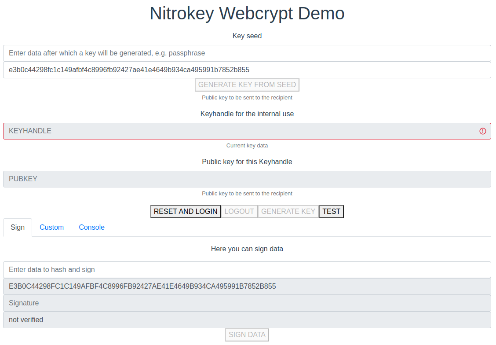

# Nitrokey Webcrypt Demo Application

This repository contains TypeScript implementation of the Nitrokey Webcrypt client, 
along with a Vue demo application using it, available at:
- https://webcrypt.nitrokey.com/

See following for more information:
- https://github.com/Nitrokey/nitrokey-webcrypt
- https://github.com/Nitrokey/nitrokey-webcrypt-tests
- https://github.com/Nitrokey/nitrokey-webcrypt-usbip



### Implemented Operations in the Demo Application
- session management (Login and Logout)
- key generation (random);
- key generation from seed;
- data signing using generated key (`Sign` tab);
- custom calls for all commands from the API (`Custom` tab);
- automatic test execution of the all commands from the API (`TEST` button).

### Usage
1. Press `RESET AND LOGIN` button to reset the device's state by calling a factory reset operation, set new PIN and establish a session.
2. Generate key - either randomly or from a key seed, with `GENERATE KEY` or `GENERATE KEY FROM SEED` respectively.
3. Sign data hash by pressing `SIGN DATA` button.
4. End session by pressing `LOGOUT`

Note: all data are presented hexadecimal. 

### Custom Calls
Using `Custom` tab it is possible to send to device any API command.
Default PIN set by `RESET AND LOGIN` is `123123`, however one can run `FACTORY_RESET` command through the `Custom` tab, and set own and login with
`SET_PIN` and `LOGIN` commands respectively.

For the fields marked as `:bytes` please enter data in hexadecimal format, and regular text for fields marked as `:string`.

### Tests
The `TEST` button calls all API commands to check for the correctness of its implementation. 
These tests are not exhaustive (that is realized by the Python test suite), but mostly test "happy paths". 


### Nitrokey Webcrypt API Documentation

See [Use Cases](./docs/use-cases.md).

## Project setup
```
yarn install
```

### Compiles and hot-reloads for development
```
yarn serve
yarn run vue-cli-service serve --https --open --host $(HOST) # for https
```

### Compiles and minifies for production
```
yarn build
```

### Lints and fixes files
```
yarn lint
```

### Customize configuration
See [Configuration Reference](https://cli.vuejs.org/config/).
